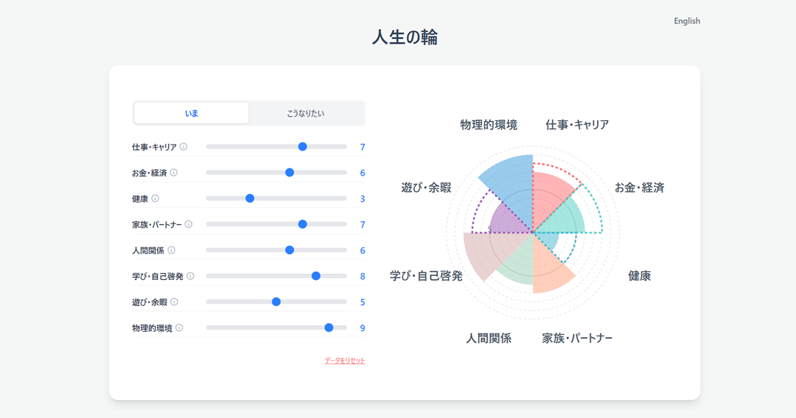

# 人生の輪 (Wheel of Life)

現在の人生の満足度と、理想の状態を可視化するコーチングツールです。
8つの分野における「現状」と「理想」のギャップを直感的に把握し、次のアクションを考える手助けをします。

[デモサイトを見る](https://kazunori0909.github.io/wheel-of-life/)



## 作ったきっかけ
オンラインでコーチングを行う際に、クライアントに印刷して記入してもらったり、ホワイトボードツールを使い上手く表現することができないのにモヤモヤしてしまいました。
そこで、生成AIを使って作ってもらおう！となり、このリポジトリを作成しました。

## 🤖 AI-Assisted Development

このプロジェクトは、**Gemini** および **Gemini Code Assist** を全面的に活用して開発されました。
企画・要件定義から、コーディング、リファクタリング、デバッグに至るまで、AIとのペアプログラミングによって構築されています。

## ✨ 特徴

- **直感的な操作**: スライダーを動かすだけで、リアルタイムにチャートが変化します。
- **現状 と 理想**: 「いま (Current)」と「こうなりたい (Ideal)」の2つのスコアを重ねて表示し、ギャップを可視化します。
- **多言語対応**: 日本語と英語 (English) をワンクリックで切り替え可能です。
- **データの保存**: ブラウザのローカルストレージにデータを自動保存。閉じた後も続きから再開できます。
- **レスポンシブデザイン**: PC、タブレット、スマートフォン、あらゆるデバイスで快適に動作します。

## 🛠 使用技術

**AI & 開発支援**
- **Gemini** (要件定義・UX設計・プロンプトエンジニアリング)
- **Gemini Code Assist** (VS Code連携・コード生成・デバッグ)

**フロントエンド**
- [Next.js 15](https://nextjs.org/) (App Router)
- [TypeScript](https://www.typescriptlang.org/)
- [Tailwind CSS](https://tailwindcss.com/)
- [Framer Motion](https://www.framer.com/motion/) (アニメーション)

**環境・デプロイ**
- Docker (DevContainer)
- GitHub Actions
- GitHub Pages (Static Export)

## 🚀 開発環境のセットアップ

このプロジェクトは Docker (DevContainer) での開発を推奨しています。

### 必要条件
- Docker Desktop
- VS Code (Dev Containers 拡張機能)

### 起動手順 (Docker)
1. VS Code でこのリポジトリを開きます。
2. 左下の緑色のボタン、またはコマンドパレットから **"Reopen in Container"** を選択します。
3. コンテナのビルド完了後、自動的に環境が立ち上がります。
4. 以下のコマンドでサーバーを起動します。

```bash
npm run dev